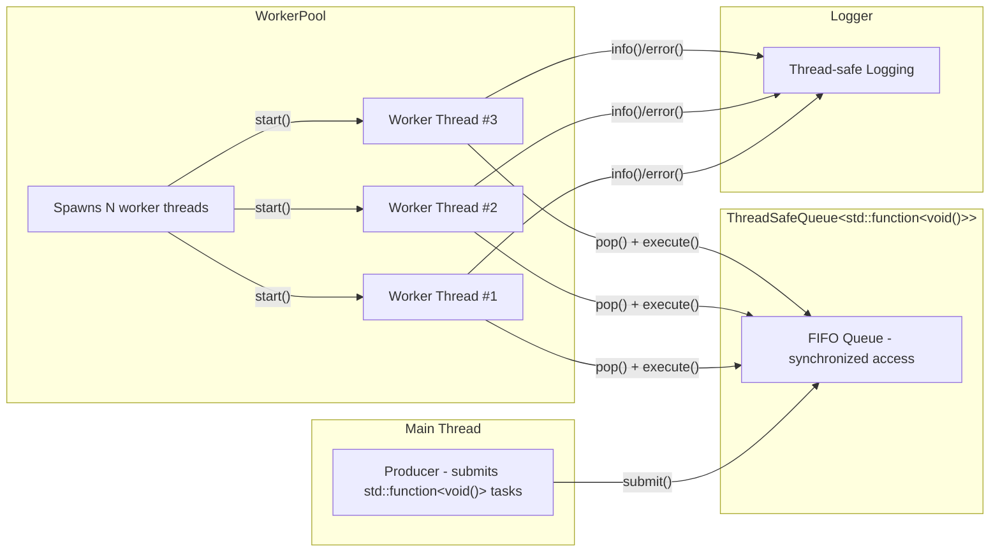
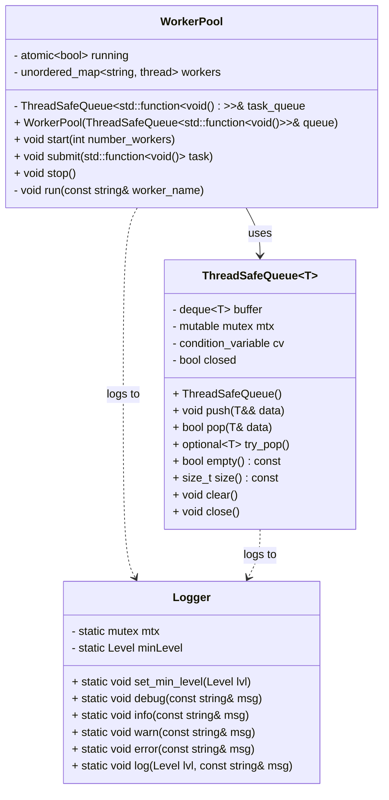

# Worker & Thread-Safe Queue


**Worker & Queue** is a modern C++14 project demonstrating a **multithreaded worker pool** that executes queued tasks concurrently using a **thread-safe queue**.  
It was developed as a **technical test** but structured as a production-quality module, including **unit testing, logging, Docker support, CI/CD integration, and clean CMake presets**.

---

## ✨ Core Features

- **Thread-safe generic queue (`ThreadSafeQueue<T>`)**  
  - Implements synchronized access using `std::mutex` and `std::condition_variable`.  
  - Provides `push()`, `pop()`, `try_pop()`, `empty()`, `size()`, `clear()`, and `close()` methods.  
  - Supports blocking `pop()` that waits for new data or shutdown signals.  
  - Designed for safe use across multiple producers and consumers.

- **Worker Pool (`WorkerPool`)**  
  - A simple yet efficient thread pool built around `ThreadSafeQueue<std::function<void()>>`.  
  - Spawns multiple worker threads that consume and execute submitted tasks concurrently.  
  - Provides lifecycle control via `start()`, `submit()`, and `stop()`.  
  - Ensures graceful shutdown and task draining before termination.  

- **Logging System (`Logger`)**  
  - Thread-safe static utility for centralized logging.  
  - Configurable minimum log level (`DEBUG`, `INFO`, `WARN`, `ERROR`).  
  - Adds timestamp and severity to each log line.  
  - Used across all components for consistent diagnostics.

---

## 🌟 Project Highlights

- **Unit testing** with GoogleTest (`ctest` integrated).  
- **Thread-safe design**: no data races or undefined behavior in queue or pool.  
- **CMake presets** for consistent builds (`debug` / `release`).  
- **Cross-platform**: builds cleanly on Linux, Windows, and inside Docker.  
- **CI integration** via GitHub Actions:
  - Builds and runs all unit tests automatically.
  - Validates Docker image reproducibility.
- **Reproducible builds** using a minimal **Ubuntu 22.04** image and **CMake 3.28**.
- **Strict compiler flags** (`-Wall -Wextra -Wpedantic`) to enforce quality and correctness.
- **C++14 compliance** — no dependency on newer standards.

---

## 🏗 Architecture

The following diagram illustrates the internal architecture of the project:

Main Thread acts as the producer — it submits tasks (lambdas or callable functions) to the ThreadSafeQueue.

ThreadSafeQueue<T> safely synchronizes access to the task queue among multiple producers and worker threads.

WorkerPool manages a configurable number of worker threads.

Each Worker Thread repeatedly calls pop() to retrieve and execute tasks until the queue is closed.

The Logger provides synchronized output from all threads, ensuring readable and timestamped logs.


---

## 🗂 Class Diagram


🔍 Explanation
- ThreadSafeQueue<T> — synchronized queue for safe producer/consumer access.
- WorkerPool — manages multiple worker threads that consume and execute tasks from the queue.
- Logger — shared static utility providing thread-safe logging.

---

## 🛠 Build Instructions

### Windows (Visual Studio 2022)

1. Open Visual Studio 2022.

2. Choose “Open Folder” → select the project root (worker_cola_multithread/).

3. Visual Studio automatically detects CMakePresets.json.

4. In the toolbar, select a configuration:

    - debug → includes unit tests (BUILD_TESTING=ON).

    - release → optimized build.

5. Build the project (Ctrl + Shift + B).

6. The executable will be generated at:

```bash
build/<preset>/cola_worker[.exe]
```

7. Run it directly from Visual Studio or from the command line.

---

### Windows (PowerShell/CLI)
You can also build manually from a terminal with CMake presets:

```powershell
cmake --preset release    # Configure for Release
cmake --build --preset release -j  # Build using Ninja or MSBuild

cmake --preset debug      # Configure for Debug (with tests)
cmake --build --preset debug -j
ctest --preset debug      # Run unit tests
```
---

### Linux / WSL (Debian/Ubuntu based)
Install dependencies:
```bash
sudo apt update
sudo apt install -y build-essential cmake ninja-build git
```
Clone and build:
```bash
git clone https://github.com/sergioguerreroblanco-oss/worker_cola_multithread.git
cd worker_cola_multithread

cmake --preset release
cmake --build --preset release -j$(nproc)

# Debug build (includes unit tests)
cmake --preset debug
cmake --build --preset debug -j$(nproc)
ctest --preset debug
```
The resulting binary will be located in:
```
build/release/cola_worker
```

### Docker (fully reproducible environment)
The project includes a Dockerfile that performs a clean build and runs tests automatically:
```bash
docker build -t cola-worker:local .
docker run --rm cola-worker:local
```

---

## 🧪 Unit Tests

Unit tests are implemented with GoogleTest and integrated into the CMake build system via CTest.
They validate the core behavior of both ThreadSafeQueue and WorkerPool to ensure thread-safe operation and correct synchronization between producer and consumer threads.

### ✅ Covered Scenarios

- ThreadSafeQueue
    - push() / pop() correctly transfer ownership of elements.
    - try_pop() safely handles empty queues.
    - close() unblocks waiting threads gracefully.
    - size() and empty() reflect real state under concurrency.

- WorkerPool
    - All submitted tasks are executed.
    - Supports variable worker counts.
    - Handles shutdown correctly, waiting for ongoing tasks.
    - Properly joins all threads at stop.

### Running Tests (Windows)

On Windows, the project has been validated with Visual Studio 2022.
Tests can be executed directly from Test Explorer:
```Menu → Test → Run All Tests```

Alternatively, you can also build and run tests using the provided CMake presets:
```powershell
cmake --preset debug
cmake --build --preset debug
ctest --preset debug --output-on-failure
```
> Note - Need to have installed: 
> 1. [CMake](https://github.com/Kitware/CMake/releases/download/v4.1.1/cmake-4.1.1-windows-x86_64.msi)
> 2. Ninja: 
>```bash 
> winget install Ninja-build.Ninja
>```

### Running Tests (Linux / Docker)

After building the project, run the following command inside the build directory:

```bash
cd build/debug
ctest --output-on-failure
```

This will automatically discover and execute all registered GoogleTest cases.

### Example output:
(example output inside container) 
```
Test project C:/worker_cola_multithread/build/debug
    Start 1: ThreadSafeQueue.PushPopWorks
1/9 Test #1: ThreadSafeQueue.PushPopWorks ...........................................................   Passed    0.01 sec
    Start 2: ThreadSafeQueue.GracefulClose
2/9 Test #2: ThreadSafeQueue.GracefulClose ..........................................................   Passed    0.01 sec
    Start 3: ThreadSafeQueue.TryPopNonBlocking
3/9 Test #3: ThreadSafeQueue.TryPopNonBlocking ......................................................   Passed    0.01 sec
    Start 4: ThreadSafeQueue.TryPopConcurrentReaders
4/9 Test #4: ThreadSafeQueue.TryPopConcurrentReaders ................................................   Passed    0.01 sec
    Start 5: WorkerPool.ExecutesAllTasks
5/9 Test #5: WorkerPool.ExecutesAllTasks ............................................................   Passed    0.52 sec
    Start 6: WorkerPoolVariations/WorkerPoolParamTest.ExecutesAllTasksWithDifferentWorkerCounts/1
6/9 Test #6: WorkerPoolVariations/WorkerPoolParamTest.ExecutesAllTasksWithDifferentWorkerCounts/1 ...   Passed    0.32 sec
    Start 7: WorkerPoolVariations/WorkerPoolParamTest.ExecutesAllTasksWithDifferentWorkerCounts/2
7/9 Test #7: WorkerPoolVariations/WorkerPoolParamTest.ExecutesAllTasksWithDifferentWorkerCounts/2 ...   Passed    0.31 sec
    Start 8: WorkerPoolVariations/WorkerPoolParamTest.ExecutesAllTasksWithDifferentWorkerCounts/4
8/9 Test #8: WorkerPoolVariations/WorkerPoolParamTest.ExecutesAllTasksWithDifferentWorkerCounts/4 ...   Passed    0.31 sec
    Start 9: WorkerPoolVariations/WorkerPoolParamTest.ExecutesAllTasksWithDifferentWorkerCounts/8
9/9 Test #9: WorkerPoolVariations/WorkerPoolParamTest.ExecutesAllTasksWithDifferentWorkerCounts/8 ...   Passed    0.32 sec
100% tests passed, 0 tests failed out of 9
Total Test time (real) =   1.83 sec

```

---

## 🐳 Docker

This project includes a Dockerfile to provide a reproducible build and test environment.

Requires Docker installed and running on your system.

Build image:

```docker build -t worker_cola_multithread:dev .```

Run tests inside container:

```docker run --rm worker_cola_multithread:dev```

Run main binary:

```docker run --rm worker_cola_multithread:dev ./build/release/cola_worker```

By default, the container builds the project in /app/build/. The binary can be invoked as shown.


---

## 🔄 Continuous Integration

This project provides two GitHub Actions workflows under .github/workflows/:

### ci.yml
This workflow performs the following steps:
- Builds the project on ubuntu-latest using CMake + Ninja and g++.
- Runs all unit tests using CTest (with detailed failure output).
- Builds the Docker image and verifies that it executes correctly inside a container.

✅ Ensures that:
- The codebase compiles cleanly on a fresh Linux environment.
- All unit tests pass consistently.
- The Docker image remains functional and up-to-date.

### docs.yml

This workflow automates documentation generation:
- Installs Doxygen, Graphviz, and LaTeX.
- Generates both HTML and PDF documentation.
- Uploads the generated artifacts for download directly from the workflow summary.
- Deploys HTML docs to GitHub Pages when pushing to the main branch.

✅ Ensures that:
- Documentation is always in sync with the current source code.
- Both HTML and PDF outputs are built automatically.
- Public docs can be viewed directly from the project’s GitHub Pages site.

---

## 📂 Project Structure

```
worker_cola_multithread/
│
├── .clang-format              # Code style configuration (Google-based, 4 spaces)
├── .dockerignore              # Files ignored during Docker build
├── .gitattributes
├── .gitignore
│
├── CMakeLists.txt             # Root CMake configuration
├── CMakePresets.json          # Build presets (Debug / Release)
├── Dockerfile                 # Docker build and test environment
├── README.md                  # Main project documentation
│
├── docs/                      # Documentation files
│   ├── Doxyfile               # Doxygen configuration
│   └── README.md              # Internal documentation guide
│
├── include/                   # Public headers
│   ├── third_party/           # External or vendor code (future extensions)
│   │   └── optional.hpp       # optional<T> for C++14 (optional-lite)
│   ├── logger.h               # Thread-safe logging utility
│   ├── thread_safe_queue.h    # Generic thread-safe queue declaration
│   ├── thread_safe_queue.ipp  # Inline template implementation
│   └── worker_pool.h          # Worker pool managing multiple threads
│
├── scripts/                   # Helper scripts
│   ├── build.ps1              # Windows build (PowerShell)
│   ├── build.sh               # Linux / WSL build script
│   ├── generate_docs.ps1      # Generate Doxygen docs on Windows
│   └── generate_docs.sh       # Generate Doxygen docs on Linux
│
├── src/                       # Source code implementation
│   ├── logger.cpp             # Logger definitions
│   ├── main.cpp               # Application entry point
│   └── worker_pool.cpp        # Worker pool logic
│
├── tests/                     # Unit test suite
│   └── test_main.cpp          # GoogleTest entry point and test cases
│
└── .github/workflows/         # CI/CD pipelines
    ├── ci.yml                 # Build, test, and Docker validation
    └── docs.yml               # Auto-generate and upload documentation


```

---

## 📖 Documentation

This project uses [Doxygen](https://www.doxygen.nl/) to generate API documentation
from source code comments.

### Generate documentation

#### Windows (PowerShell)
```powershell
Set-ExecutionPolicy -Scope Process -ExecutionPolicy Bypass
.\scripts\generate_docs.ps1
```
Generates HTML (docs/html/index.html) and LaTeX sources (docs/latex/).

PDF (refman.pdf) is not generated on Windows unless you install a full LaTeX toolchain (MiKTeX/TeX Live + make).

#### Linux / WSL (Debian/Ubuntu based)
```bash
sudo apt update
sudo apt install -y doxygen graphviz texlive-latex-base texlive-fonts-recommended texlive-latex-extra make
chmod +x scripts/generate_docs.sh
./scripts/generate_docs.sh
```
Generates HTML (docs/html/index.html) and PDF (docs/latex/refman.pdf).

Open in your browser:
```bash
docs/html/index.html
```

For more details, see docs/README.md

---

## 🎨 Code Style (clang-format)

This project uses **clang-format** to enforce a consistent C++ code style.  
The formatting rules are defined in [`.clang-format`](./.clang-format). 

### 🔧 Chosen Style

The configuration is based on Google C++ Style, with a few modifications to improve readability for embedded and multithreaded systems:

| Setting                                 | Value               | Description                                                                      |
| --------------------------------------- | ------------------- | -------------------------------------------------------------------------------- |
| **BasedOnStyle**                        | `Google`            | Provides a solid, modern baseline for C++ formatting.                            |
| **Language**                            | `Cpp`               | Ensures C++-specific syntax rules (not generic C).                               |
| **IndentWidth / TabWidth**              | `4`                 | Uses 4 spaces per indent (vs Google’s default 2) for improved block readability. |
| **UseTab**                              | `Never`             | Enforces spaces only (consistent across editors).                                |
| **ColumnLimit**                         | `100`               | Balances readability and long template expressions.                              |
| **BreakBeforeBraces**                   | `Allman`            | Places braces on their own line, improving visual structure in nested code.      |
| **AllowShortIfStatementsOnASingleLine** | `false`             | Forces explicit line breaks for clarity.                                         |
| **AllowShortLoopsOnASingleLine**        | `false`             | Prevents compact loop bodies from being overlooked.                              |
| **AllowShortFunctionsOnASingleLine**    | `Inline`            | Allows concise inline functions on a single line only.                           |
| **PointerAlignment**                    | `Left`              | Keeps `T* ptr` instead of `T *ptr` — cleaner and more conventional in C++.       |
| **DerivePointerAlignment**              | `false`             | Disables automatic guessing; enforces explicit `PointerAlignment`.               |
| **SpaceBeforeParens**                   | `ControlStatements` | Adds a space in `if (` / `while (` for readability, not for calls.               |
| **SortIncludes**                        | `true`              | Automatically organizes include directives alphabetically.                       |
| **IncludeBlocks**                       | `Regroup`           | Groups and reorders includes logically within the file.                          |
| **AlignConsecutiveAssignments**         | `true`              | Improves alignment of variable assignments.                                      |
| **AlignConsecutiveDeclarations**        | `true`              | Aligns consecutive variable declarations.                                        |
| **AlignOperands**                       | `true`              | Keeps arithmetic/logical expressions neatly aligned.                             |
| **CommentPragmas**                      | `'^!'`              | Allows pragma-specific comment formatting.                                       |
| **FixNamespaceComments**                | `true`              | Automatically adds trailing `// namespace X` comments when closing.              |
| **SpacesBeforeTrailingComments**        | `2`                 | Keeps a consistent gap before end-of-line comments.                              |
| **KeepEmptyLinesAtTheStartOfBlocks**    | `false`             | Avoids unnecessary blank lines at block starts.                                  |

---

### Windows (Visual Studio Code / PowerShell)

1. Install LLVM (includes clang-format):

    - Download the LLVM installer for Windows (`https://github.com/llvm/llvm-project/releases`)
    
    - During setup, check “Add LLVM to the system PATH”.

2. Verify installation:

```PowerShell
clang-format --version
```
3. Format all project files:
```PowerShell
clang-format -i include\*.h include\*.ipp src\*.cpp tests\*.cpp
```
### Linux / WSL (Debian/Ubuntu based)

1. Install clang-format:
```bash
sudo apt update
sudo apt install -y clang-format
```
2. Verify installation:
```bash
clang-format --version
```
3. Format all project files:
```bash
clang-format -i include/*.h include/*.ipp src/*.cpp tests/*.cpp
```

---

## 📌 Notes

- **C++ Standard**: C++ 14 (set(CMAKE_CXX_STANDARD 14)).
    
    Since std::optional is only available from C++ 17, this project integrates the lightweight [optional-lite](https://github.com/nonstd-lite/optional-lite) library (include/third_party/optional.hpp) to preserve equivalent semantics while remaining compatible with C++14.
- **Thread Safety**: Fully managed through std::mutex, std::condition_variable, and std::atomic.

    All shared data access is synchronized using RAII-based locking (std::lock_guard, std::unique_lock).

- **Extensibility**:
    
    The worker logic is decoupled from its execution policy through a clear separation of responsibilities.
    The WorkerPool manages concurrency, while individual tasks (via std::function<void()>) define behavior — allowing flexible and testable extensions.

- **Logging**:

    Centralized thread-safe Logger utility with severity levels (DEBUG, INFO, WARN, ERROR), ensuring coherent runtime diagnostics across threads.

- **Cross-Platform Compatibility**:

    Successfully builds and runs on:

        - 🪟 Windows (MSVC 2022)
        - 🐧 Linux (g++)
        - 🐳 Docker container environments

        Each environment uses consistent CMake presets to simplify builds and CI/CD automation.

- **Queue Implementation**:
    
    ThreadSafeQueue<T> uses an internal std::deque<T> instead of a custom circular buffer.
    This approach prioritizes simplicity, STL optimization, and correctness, while maintaining a deterministic FIFO order.
    A fixed-size limit could be trivially added, but for this design, unbounded size with explicit control (close(), clear()) provides better testability and robustness.

- **Design Decision: Graceful Shutdown Philosophy**
    
    Earlier designs included explicit shutdown signaling (shutdown() with return states like OK, TIMEOUT, CLOSED).
    This was intentionally removed to keep the queue a pure, passive synchronization primitive.
    Instead, lifecycle management occurs externally:

        - The WorkerPool sets a closed flag and signals all waiting threads via notify_all().
        - Each worker exits naturally after completing the next pop() cycle.
        - This approach avoids adding control logic into the data structure, preserving single-responsibility and predictable synchronization semantics.

---

## ❤️ Acknowledgements

This project was originally developed as part of a technical assessment,
then extended into a fully professional implementation showcasing:
- Clean architecture and modular design.
- Template-based generic programming.
- Thread-safe data structures and concurrency patterns.
- Comprehensive Doxygen documentation.
- Automated testing (GoogleTest + CTest).
- CI/CD pipelines (GitHub Actions).
- Cross-platform Docker-based builds.