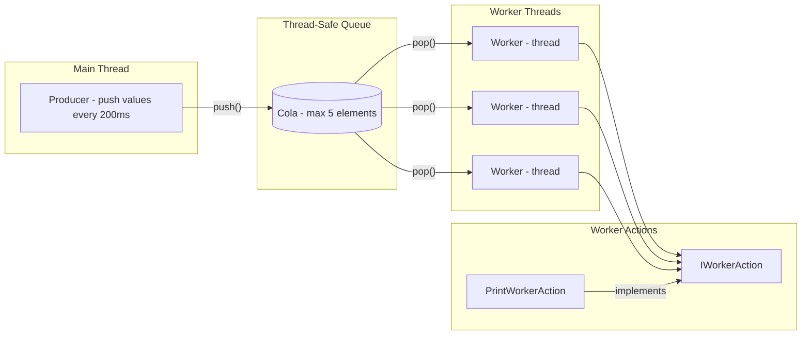
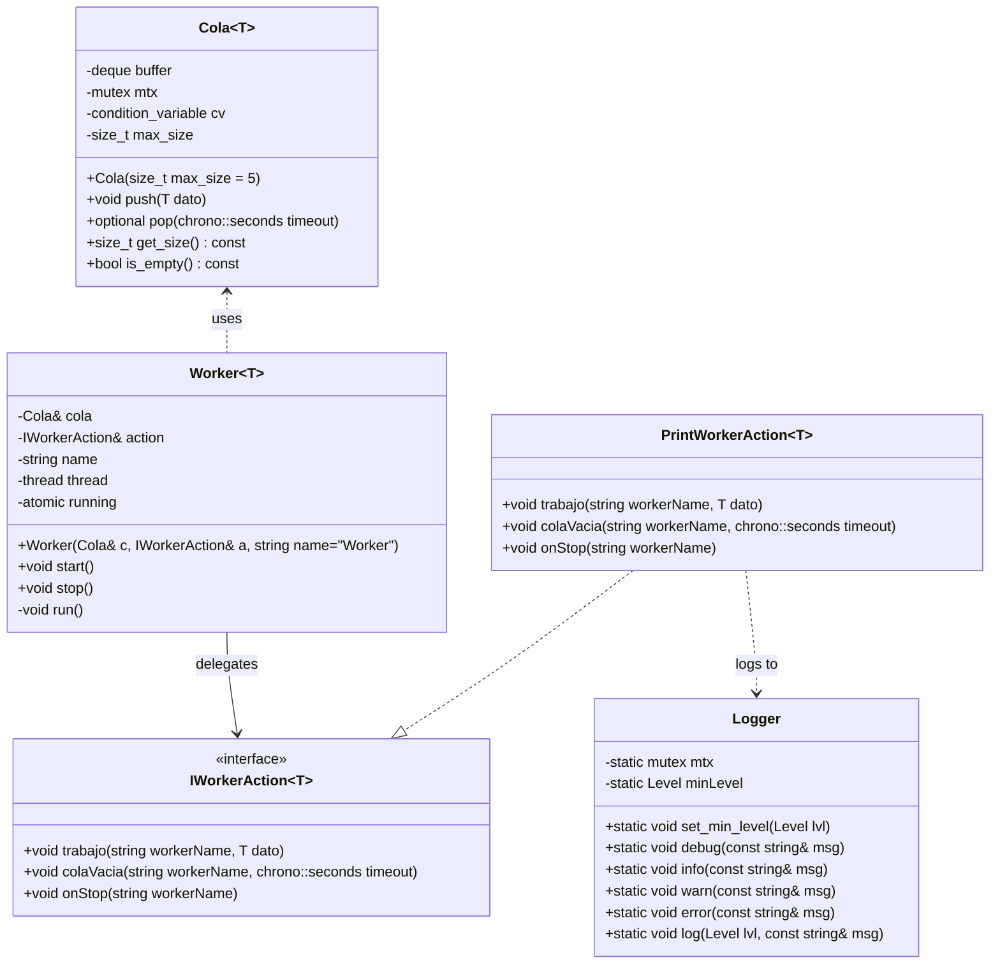

# Cola & Worker


Cola & Worker is a C++ project that demonstrates a producer–consumer pattern with a bounded, thread-safe queue and multiple worker threads.  
It has been designed as part of a technical test, but structured in a professional way, including **templates, abstract interfaces, unit tests, logging, Docker support, CI/CD pipelines, and modern C++ practices such as `optional` for safe return values.**

---

## ✨ Core Features


- **Thread-safe bounded queue (`Cola<T>`)**  
  - Generic template with configurable maximum size (default: 5).  
  - FIFO with automatic removal of the oldest element when the limit is reached.  
  - `pop()` supports **configurable timeout** and returns a `nonstd::optional<T>`:  
    - `value()` when an element is available.  
    - `nullopt` when the queue remains empty during the wait period.  
  - The queue remains deliberately minimal (“dumb”): it does not implement shutdown logic.  

- **Workers (`Worker<T>`)**  
  - Each worker runs in its own thread and consumes data from the queue concurrently.  
  - Automatically handles **timeout** scenarios.  
  - Supports clean termination when `stop()` is called.  
  - Behavior is delegated through the **abstract interface** `IWorkerAction<T>`.  

- **Extensibility via Interfaces**  
  - `IWorkerAction<T>` defines key events: `trabajo()`, `colaVacia()`, and `onStop()`.  
  - Makes it easy to inject different behaviors without modifying the `Worker` class.  

- **Concrete Action Example**  
  - `PrintWorkerAction<T>` implements the interface to log worker events.  
  - Provided as a demonstration, but can be easily replaced with custom actions.  

- **Thread-safe Logger**  
  - Centralized utility with log levels (`DEBUG`, `INFO`, `WARN`, `ERROR`).  
  - Reusable across any action or additional component.  


## 🌟 Project Highlights

- **Unit tests** with GoogleTest, validating queue size limits, FIFO behavior, and timeout handling.  
- **Centralized logging** (`Logger`) with thread safety and severity levels (DEBUG, INFO, WARN, ERROR).  
- **Automatic documentation** with Doxygen-ready headers.  
- **Continuous Integration** with GitHub Actions:
    - **ci.yml** → build, run tests, and validate Docker image.
    - **docs.yml** → generate and upload HTML/PDF documentation.
- **Reproducible builds** with Docker, using a Debian/Ubuntu base image.  
- **Cross-platform compatibility**: builds on Windows (MSVC), Linux (g++) and Clang, and inside Docker.  
- **Strict compiler warnings**: `/W4` on MSVC, `-Wall -Wextra -Wpedantic` on GCC/Clang.  
- **CMake presets** to simplify builds across environments.  
- **C++14 compliant**: although `std::optional` is part of C++ 17, this project integrates the [optional-lite](https://github.com/martinmoene/optional-lite) third-party library to provide equivalent functionality while preserving C++ 14 compatibility.  

---

## 🏗 Architecture
The following diagram illustrates the internal architecture of the project.
- **Main Thread** simulates a producer pushing values into the queue at fixed intervals.
- **Cola<T>** is a thread-safe bounded queue that stores up to 5 elements and synchronizes access among threads.
- **Worker<T>** consumes values from the queue and delegates the actual handling of events to an action (strategy pattern).
- **IWorkerAction** defines the contract for worker actions.
- **PrintWorkerAction** implements this contract by logging messages.


---

## 🗂 Class Diagram



---

## 🛠 Build Instructions

### Windows (Visual Studio 2022)

1. Open **Visual Studio 2022**.  
2. *Open Folder* → select the project root (`cola-worker-test/`).  
3. Visual Studio will detect `CMakePresets.json`.  
4. In the toolbar, select a configuration (`debug` or `release`).  
5. Build (Ctrl+Shift+B).  
6. Run the generated binary `cola_worker[.exe]` from `build/<config>/`.

---

### Windows (PowerShell)
```powershell
Set-ExecutionPolicy -Scope Process -ExecutionPolicy Bypass
.\scripts\build.ps1 -preset release   # Build Release
.\scripts\build.ps1 -preset debug     # Build Debug (with tests)
```
---

### Linux / WSL (Debian/Ubuntu based)

Install required tools:
```bash
sudo apt update
sudo apt install -y build-essential cmake ninja-build git
```
Clone repository (first time only):
```bash
git clone https://github.com/sergioguerreroblanco-oss/cola-worker-test.git
cd cola-worker-test
```
Build project:
```bash
chmod +x scripts/build.sh
./scripts/build.sh --preset release   # Build Release
./scripts/build.sh --preset debug     # Build Debug (with tests)
```

---

## 🧪 Unit Tests

Unit tests are implemented with GoogleTest and integrated into the CMake build system via CTest.
They validate the main behavior of the queue (Cola<T>):
- Maximum size enforcement.
- FIFO ordering.
- Timeout behavior.
- Shutdown behavior.

### Running Tests (Windows)

On Windows, the project has been validated with Visual Studio 2022.
Tests can be executed directly from Test Explorer:
```Menu → Test → Run All Tests```

Alternatively, you can also build and run tests using the provided CMake presets:
```powershell
cmake --preset debug
cmake --build --preset debug
ctest --preset debug --output-on-failure
```
> Note - Need to have installed: 
> 1. [CMake](https://github.com/Kitware/CMake/releases/download/v4.1.1/cmake-4.1.1-windows-x86_64.msi)
> 2. Ninja: 
>```bash 
> winget install Ninja-build.Ninja
>```

### Running Tests (Linux / Docker)

After building the project, run the following command inside the build directory:

```bash
cd build/debug
ctest --output-on-failure
```

This will automatically discover and execute all registered GoogleTest cases.

### Example output:
(example output inside container) 
```
Test project C:/cola-worker-test/build/debug
    Start 1: ColaTest.KeepMaxBufferSize
1/5 Test #1: ColaTest.KeepMaxBufferSize .........................................   Passed    0.01 sec
    Start 2: ColaTest.PopReturnsTimeout
2/5 Test #2: ColaTest.PopReturnsTimeout .........................................   Passed    1.01 sec
    Start 3: MultipleSequences/ColaFifoTest.ExtractsInOrder/{ 10, 20 }
3/5 Test #3: MultipleSequences/ColaFifoTest.ExtractsInOrder/{ 10, 20 } ..........   Passed    0.01 sec
    Start 4: MultipleSequences/ColaFifoTest.ExtractsInOrder/{ 1, 2, 3, 4, 5 }
4/5 Test #4: MultipleSequences/ColaFifoTest.ExtractsInOrder/{ 1, 2, 3, 4, 5 } ...   Passed    0.01 sec
    Start 5: MultipleSequences/ColaFifoTest.ExtractsInOrder/{ 42 }
5/5 Test #5: MultipleSequences/ColaFifoTest.ExtractsInOrder/{ 42 } ..............   Passed    0.01 sec
100% tests passed, 0 tests failed out of 5
Total Test time (real) =   1.05 sec
```

---

## 🐳 Docker

This project includes a Dockerfile to provide a reproducible build and test environment.

Requires Docker installed and running on your system.

Build image:

```docker build -t cola-worker:dev .```

Run tests inside container:

```docker run --rm cola-worker:dev```

Run main binary:

```docker run --rm cola-worker:dev ./build/cola_worker```

By default, the container builds the project in /app/build/. The binary can be invoked as shown.


---

## 🔄 Continuous Integration

This project provides two GitHub Actions workflows under .github/workflows/:

### ci.yml

- Builds and runs unit tests on ubuntu-latest using CMake and g++.
- Builds the Docker image and executes the binary/tests inside the container.

This ensures that:

- The code always compiles on a clean environment.
- All unit tests pass successfully on each push/pull request.
- The project works both in native Linux and inside a reproducible Docker container.

### docs.yml

- Installs Doxygen (and LaTeX on Linux).
- Generates documentation (HTML and PDF).
- Uploads the generated artifacts so they can be downloaded directly from the workflow run.

This ensures that:
- Documentation is always up to date with the source code.
- Both HTML and PDF docs are available without needing local generation.

---

## 📂 Project Structure

```
cola-worker-test/
│
├── .clang-format              # Code style configuration
├── .dockerignore
├── .gitignore
├── CMakeLists.txt             # Build configuration
├── CMakePresets.json          # Build presets (debug/release)
├── Dockerfile                 # Docker build context
├── README.md                  # Project documentation
│
├── docs/                      # Documentation
│   ├── Doxyfile               # Doxygen configuration
│   └── README.md              # Docs instructions
│
├── include/                   # Public headers and templates
│   ├── third_party/           # External headers (C++14 backports)
│   │   └── optional.hpp       # optional<T> for C++14 (optional-lite)
│   ├── cola.h
│   ├── cola.ipp
│   ├── i_worker_action.h
│   ├── logger.h
│   ├── print_worker_action.h
│   ├── worker.h
│   └── worker.ipp
│
├── scripts/                   # Utility scripts
│   ├── build.sh               # Linux build script
│   ├── build.ps1              # Windows build script
│   ├── generate_docs.sh       # Linux/WSL docs generation
│   └── generate_docs.ps1      # Windows docs generation
│
├── src/                       # Source files
│   ├── logger.cpp
│   └── main.cpp
│
├── tests/                     # Unit tests
│   └── test_main.cpp
│
└── .github/workflows/         # CI/CD pipelines
    ├── ci.yml                 # Build & test workflow
    └── docs.yml               # Documentation workflow

```

---

## 📖 Documentation

This project uses [Doxygen](https://www.doxygen.nl/) to generate API documentation
from source code comments.

### Generate documentation

#### Windows (PowerShell)
```powershell
Set-ExecutionPolicy -Scope Process -ExecutionPolicy Bypass
.\scripts\generate_docs.ps1
```
Generates HTML (docs/html/index.html) and LaTeX sources (docs/latex/).

PDF (refman.pdf) is not generated on Windows unless you install a full LaTeX toolchain (MiKTeX/TeX Live + make).

#### Linux / WSL (Debian/Ubuntu based)
```bash
sudo apt update
sudo apt install -y doxygen graphviz texlive-latex-base texlive-fonts-recommended texlive-latex-extra make
chmod +x scripts/generate_docs.sh
./scripts/generate_docs.sh
```
Generates HTML (docs/html/index.html) and PDF (docs/latex/refman.pdf).

Open in your browser:
```bash
docs/html/index.html
```

For more details, see docs/README.md

---

## 🎨 Code Style (clang-format)

This project uses **clang-format** to enforce a consistent C++ code style.  
The formatting rules are defined in [`.clang-format`](./.clang-format). 

### Chosen Style

This project uses a `.clang-format` configuration derived from **Google C++ Style**,  
with a few adjustments tailored for readability and consistency:

- **IndentWidth: 4** → default Google style uses 2 spaces; 4 spaces give more clarity for nested code.  
- **ColumnLimit: 100** → avoids very long lines while still allowing expressive function names and templates.  
- **Language: Cpp** → ensures the formatter applies C++ rules (not generic C).  
- **Standard: Cpp11** → compatible setting for clang-format; matches well with the project’s target (C++14).  

### Windows (Visual Studio Code / PowerShell)

1. Install LLVM (includes clang-format):

    - Download the LLVM installer for Windows (`https://github.com/llvm/llvm-project/releases`)
    
    - During setup, check “Add LLVM to the system PATH”.

2. Verify installation:

```PowerShell
clang-format --version
```
3. Format all project files:
```PowerShell
clang-format -i include\*.h include\*.ipp src\*.cpp tests\*.cpp
```
### Linux / WSL (Debian/Ubuntu based)

1. Install clang-format:
```bash
sudo apt update
sudo apt install -y clang-format
```
2. Verify installation:
```bash
clang-format --version
```
3. Format all project files:
```bash
clang-format -i include/*.h include/*.ipp src/*.cpp tests/*.cpp
```

---

## 📌 Notes

- C++ Standard: C++14 (set(CMAKE_CXX_STANDARD 14)).
  - Since `std::optional` is only available from C++ 17, this project integrates the lightweight **optional-lite** library (`third_party/optional.hpp`) to preserve the same semantics in C++ 14.
- Thread Safety: Managed with std::mutex, std::condition_variable, and std::atomic.
- Extensibility: Worker actions decoupled via `IWorkerAction` interface 
  → new behaviors can be added without modifying worker logic.
- Logging: Centralized Logger utility with severity levels.
- Cross-Platform: Builds on Windows (MSVC), Linux (g++) and Docker.
- Queue implementation: `Cola<T>` uses `std::deque` internally rather than a custom array-based buffer. This choice favors **simplicity, correctness, and STL optimizations**, while still enforcing the bounded size (default: 5 elements). A custom queue could have been implemented, but `std::deque` provides robust, well-tested behavior with minimal overhead.
- **Design decision on shutdown handling**:  
  - Originally, the queue (`Cola<T>`) exposed a `shutdown()` method and returned explicit states (`OK`, `TIMEOUT`, `SHUTDOWN`).  
  - This was removed to keep the queue a **pure, passive data structure** without any knowledge of program flow or lifecycle.  
  - Workers (`Worker<T>`) were considered for graceful/immediate shutdown semantics, but they rely on a blocking `pop()` with a fixed timeout (5s, as required).  
  - Allowing workers to interrupt `pop()` would require making the queue “smarter” (e.g., introducing sentinel values or cancellation flags), which would break the intended design philosophy.  
  - Therefore, workers stop naturally after the next timeout cycle, and this behavior was **documented explicitly** rather than forcing extra complexity into the queue or worker.

---

## ❤️ Acknowledgements

This project was developed as a technical test and extended to include professional practices such as **templates, interfaces, logging, unit testing, CI/CD and containerization.**

